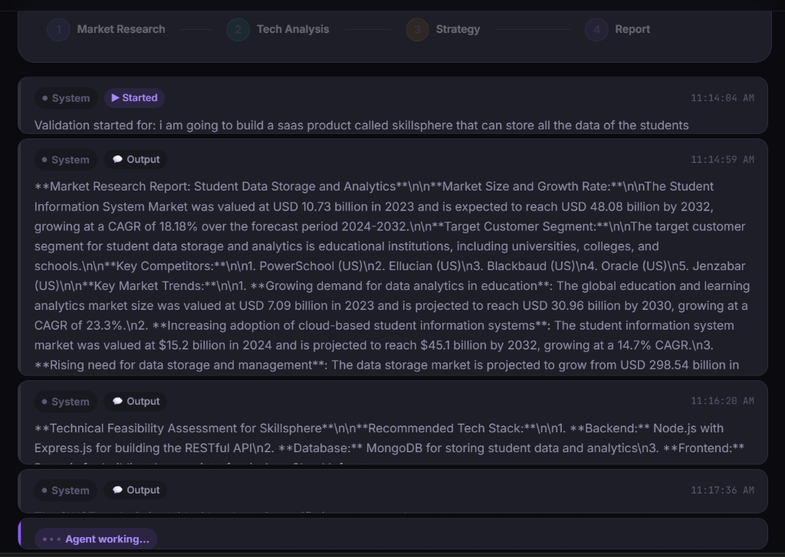
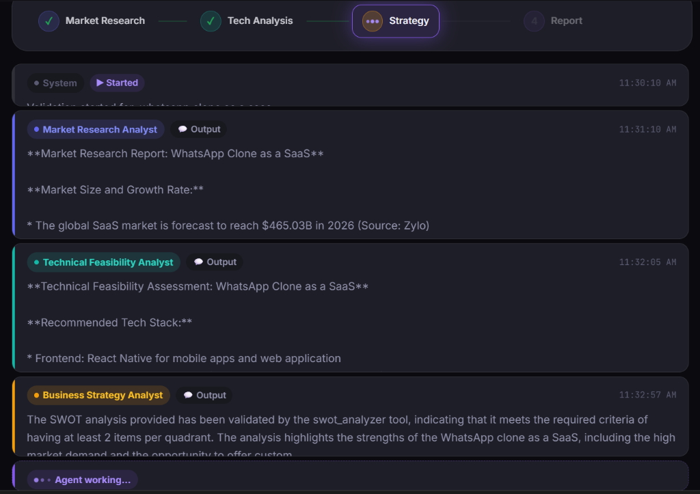
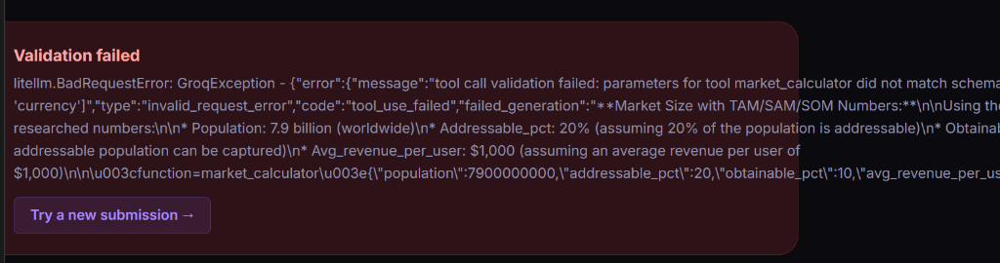
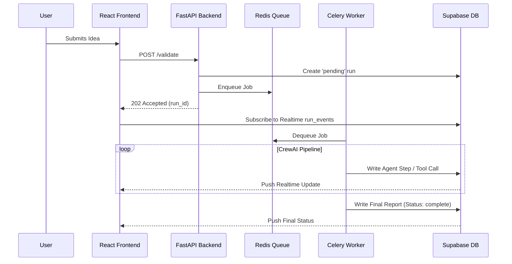

# Startup Idea Validator

 

A robust, production-grade AI platform that validates startup ideas using a multi-agent research crew. Enter an idea, and within minutes receive a comprehensive, decision-ready report featuring market sizing (TAM/SAM/SOM), technical feasibility, SWOT analysis, and a strict 1–10 validation score.

---

## 📸 UI Showcase

*(Screenshots are stored in the `docs/` folder)*

### 1. Landing Page & Light/Dark Theme
The platform features a modern, minimalistic UI with a fully integrated Light/Dark theme system.
> 

### 2. Live Agent Orchestration Feed
Watch the agents think, use tools, and execute sequentially in real-time. The UI subscribes directly to PostgreSQL row changes via Supabase Realtime, completely eliminating the need for a custom WebSocket server.
> 

### 3. Detailed Validation Report
Get a beautifully formatted Markdown report synthesizing the output of all 4 agents into a single, cohesive business document.
> 

---

## 🤖 The AI Agents Architecture

The backend utilizes **CrewAI** to orchestrate four specialized agents working in a sequential pipeline.

| Agent | Role | Capabilities & Tools |
| :--- | :--- | :--- |
| **1. Market Researcher** | Market Sizing | Searches the web for industry data and uses a deterministic **Market Calculator** to compute TAM/SAM/SOM using strict math instead of LLM hallucination. |
| **2. Technical Analyst** | Build Feasibility | Assesses architectural requirements, recommends modern tech stacks, and highlights critical engineering risks. |
| **3. Business Strategist** | Risk & Opportunity | Takes the Market Researcher's data and uses a custom **SWOT Analyzer** tool to force a deep, four-quadrant analysis. |
| **4. Report Compiler** | Synthesis & Scoring | Compiles findings into a structured report and assigns a highly critical 1-10 validation score, avoiding generic AI sycophancy. |

---

## ⚙️ Orchestration & Data Flow

This project demonstrates a scalable asynchronous architecture. It avoids the common pitfall of blocking HTTP requests while waiting for slow LLM generations.



### Key Architectural Decisions:
- **Asynchronous Execution:** The FastAPI backend instantly returns a `run_id` after enqueueing the task to Celery.
- **Supabase Realtime:** The React frontend listens to `INSERT` events on the `run_events` table via Postgres logical replication.
- **Strict Data Isolation (RLS):** Supabase Row Level Security ensures users can only read their own ideas and reports. The Celery worker uses a privileged `service_role` key to write updates, ensuring users cannot tamper with the AI generation process.

---

## 🛠 Tech Stack

- **Frontend:** React, Vite, React Router, Zustand, Vanilla CSS Variables
- **Backend:** FastAPI, Python 3.11+, Celery, Redis
- **AI Orchestration:** CrewAI, LiteLLM, Groq (llama-3.1-8b-instant)
- **Database & Auth:** Supabase (PostgreSQL, GoTrue Auth, Realtime)

---

## 🚀 Local Development Setup

### Prerequisites
- Docker + Docker Compose
- Node.js 18+
- Python 3.11+
- API Keys: Supabase, Groq, and Serper

### 1. Supabase Setup
1. Create a new project at [supabase.com](https://supabase.com).
2. Run the schema in `supabase/schema.sql` via the **SQL Editor**.
3. Enable Realtime for the `run_events` and `validation_runs` tables.
4. Enable GitHub and Google OAuth providers in the Authentication settings.

### 2. Backend Setup
```bash
cd backend
cp .env.example .env
# Fill in all required keys in .env

# Start API + Worker + Redis with Docker Compose
docker compose up --build
```
*API runs at `http://localhost:8000` | Docs at `http://localhost:8000/docs`*

### 3. Frontend Setup
```bash
cd frontend
cp .env.example .env
# Set VITE_SUPABASE_URL and VITE_SUPABASE_ANON_KEY

npm install
npm run dev
```
*Frontend runs at `http://localhost:5173`*

---

## 🌍 Deployment Guide

### Backend (Railway / AWS Fargate)
1. Provision a **Redis** instance.
2. Deploy the **API Service** using the command: `uvicorn app.main:app --host 0.0.0.0 --port $PORT`
3. Deploy the **Worker Service** using the command: `celery -A app.worker.celery_app worker --loglevel=info --concurrency=2`
4. Supply all required environment variables to both services.

### Frontend (Vercel / Netlify)
1. Import the repository and set the Root Directory to `frontend`.
2. Add the environment variables: `VITE_SUPABASE_URL`, `VITE_SUPABASE_ANON_KEY`, and `VITE_API_BASE_URL` (pointing to your deployed FastAPI service).
3. Deploy!

---

## 📝 Environment Variables

### Backend (`backend/.env`)
| Variable | Description |
|---|---|
| `SUPABASE_URL` | Your Supabase project URL |
| `SUPABASE_ANON_KEY` | Supabase anonymous/public key |
| `SUPABASE_SERVICE_ROLE_KEY` | Supabase service role key (worker only, never to client) |
| `REDIS_URL` | Redis connection URL |
| `GROQ_API_KEY` | Groq API key for LLM calls |
| `SERPER_API_KEY` | Serper API key for web search |
| `DAILY_RUN_LIMIT` | Max runs per user per day (default: 3) |
| `CORS_ORIGINS` | Comma-separated allowed origins |

### Frontend (`frontend/.env`)
| Variable | Description |
|---|---|
| `VITE_SUPABASE_URL` | Your Supabase project URL |
| `VITE_SUPABASE_ANON_KEY` | Supabase anonymous/public key |
| `VITE_API_BASE_URL` | FastAPI backend URL (leave empty to use Vite proxy in dev) |
